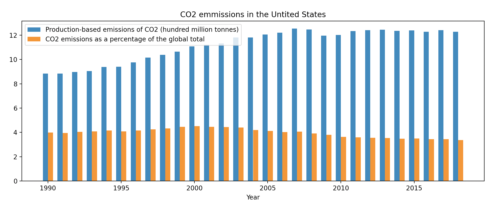
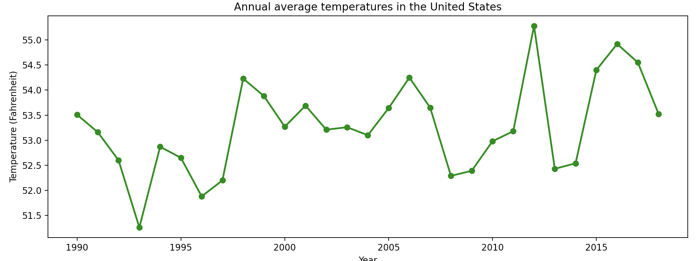

# CS40 Homework2: Visualizing interesting datasets

**Description:**
    For this homework, I researched data on the topic that interests me - climate change. As it was proven, CO2 emissions play a role in a global waming, so I searched for data that show CO2 emisions in the Unite states. I also took a look at the average annual temperatures in the United States since 1990.

## First plot: Production-based CO2 emissions in the U.S. and CO2emissions as a percentage of global total (1990-2018)

bla bla bla bla

## Second plot: Annual average temperatures in the United States (1990-2018)

hahaha helllooo

[temperature data source](https://www.statista.com/statistics/500472/annual-average-temperature-in-the-us/)

[co2 data source](https://ourworldindata.org/co2-and-other-greenhouse-gas-emissions)
found through [this page on github](https://github.com/owid/co2-data) and then modified for my purpose

